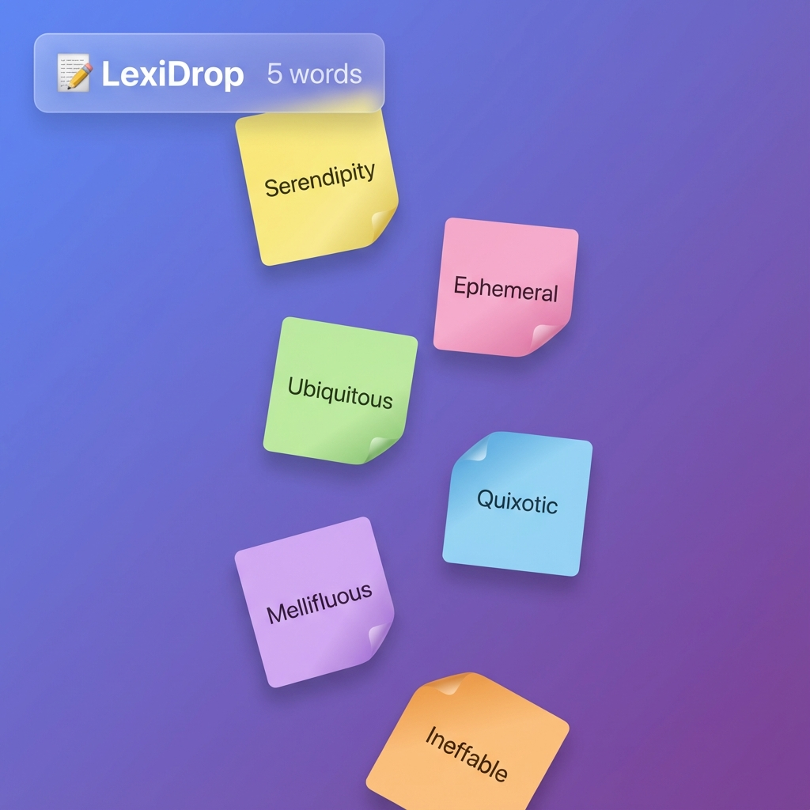
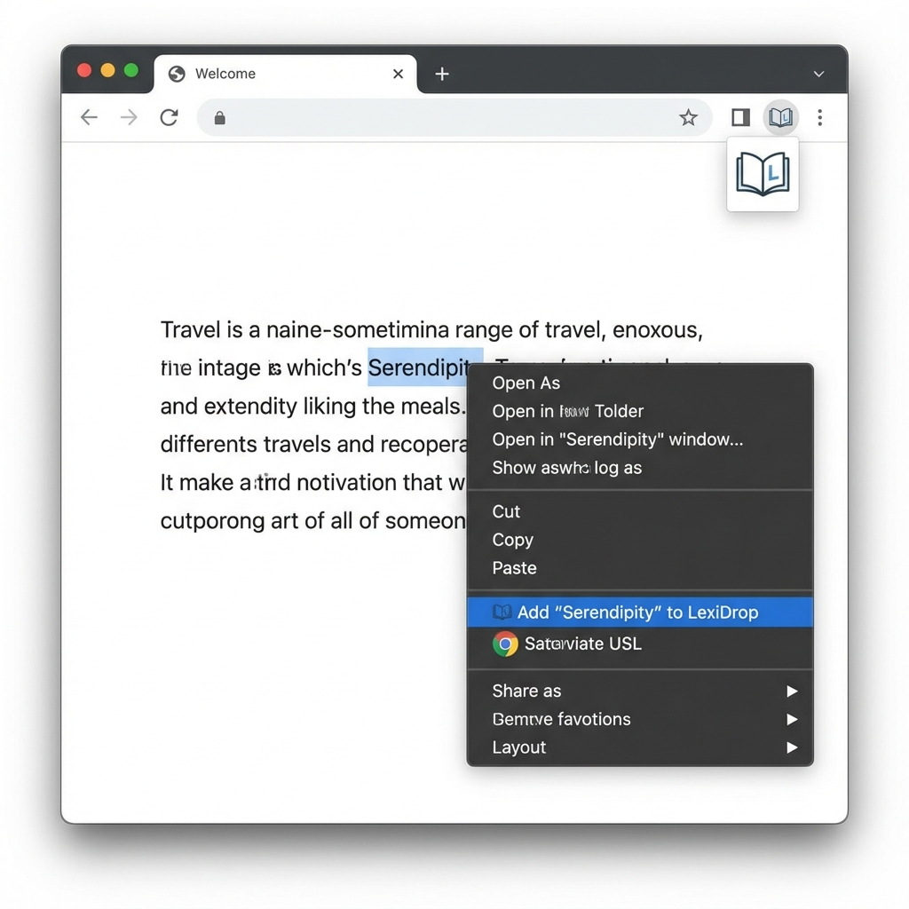
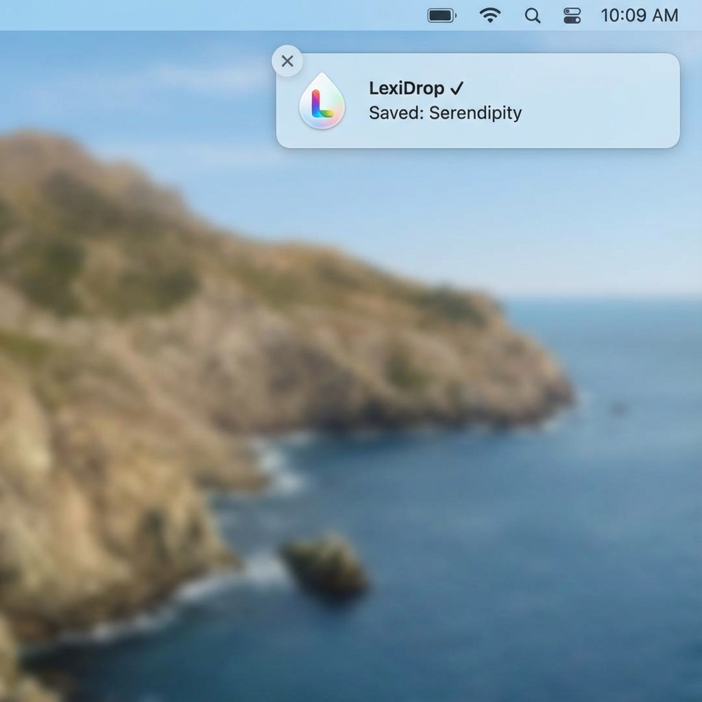

# 📝 LexiDrop

> **AI-Powered Vocabulary Tracker with Physics-Based Dashboard**

LexiDrop is a personal vocabulary learning tool that lets you capture words from any webpage with a single right-click. Using Google's Gemini AI, it instantly generates translations and explanations, then displays your vocabulary collection as interactive sticky notes that fall and bounce on a physics-simulated dashboard.



---

## ✨ Features

### 🖱️ **Capture Words Instantly**
Select any word on any webpage, right-click, and add it to your collection with "Add to LexiDrop".



### 🤖 **AI-Powered Explanations**
Google Gemini automatically generates translations and detailed explanations for every word you save.

### 🎯 **Physics-Based Dashboard**
Your vocabulary appears as colorful sticky notes that fall, bounce, and can be dragged around on a beautiful physics-simulated whiteboard.

### 🔊 **Text-to-Speech Tutor**
Double-click any word to hear its pronunciation — supports both English and Chinese!

### 🔔 **Real-time Notifications**
Get instant feedback when words are saved with Chrome notifications.



---

## 🛠️ Tech Stack

| Component | Technology |
|-----------|------------|
| **Chrome Extension** | Manifest V3, Context Menus API |
| **Backend** | Node.js, Express, TypeScript |
| **Database** | SQLite with Prisma ORM |
| **AI** | Google Gemini (`@google/generative-ai`) |
| **Frontend** | React, Vite, TypeScript |
| **Physics Engine** | Matter.js |

---

## 📁 Project Structure

```
lexidrop/
├── client/           # React dashboard with Matter.js physics
│   ├── src/
│   │   ├── PhysicsBoard.tsx   # Main physics simulation component
│   │   └── ...
│   └── package.json
│
├── server/           # Express API with Gemini AI integration
│   ├── src/
│   │   ├── index.ts           # API routes
│   │   └── services/ai.ts     # Gemini AI service
│   ├── prisma/                # Database schema
│   └── package.json
│
├── extension/        # Chrome Extension (Manifest V3)
│   ├── manifest.json
│   ├── background.js          # Service worker
│   └── icons/
│
└── PROJECT_SPEC.md   # Detailed project specification
```

---

## 🚀 Getting Started

### Prerequisites
- Node.js 18+
- Google Gemini API Key ([Get one free](https://makersuite.google.com/app/apikey))
- Chrome Browser

### 1. Clone the Repository
```bash
git clone https://github.com/YOUR_USERNAME/lexidrop.git
cd lexidrop
```

### 2. Setup the Server
```bash
cd server
npm install
npx prisma generate
npx prisma db push

# Create .env file with your API key
echo "GEMINI_API_KEY=your_api_key_here" > .env

# Start the server
npm run dev
```

### 3. Setup the Client
```bash
cd client
npm install
npm run dev
```

### 4. Install the Chrome Extension
1. Open Chrome and go to `chrome://extensions/`
2. Enable "Developer mode" (toggle in top-right)
3. Click "Load unpacked"
4. Select the `extension` folder

---

## 📖 How to Use

1. **Start both servers** (backend on port 3001, frontend on port 5173)
2. **Browse any webpage** with text content
3. **Select a word** you want to learn
4. **Right-click** and choose "Add '[word]' to LexiDrop"
5. **Open the dashboard** at `http://localhost:5173` to see your words!
6. **Double-click** any sticky note to hear pronunciation

---

## 🔌 API Endpoints

| Method | Endpoint | Description |
|--------|----------|-------------|
| `POST` | `/api/save` | Save a new word for AI processing |
| `GET` | `/api/words` | Get all completed word entries |
| `GET` | `/api/words/all` | Get all entries (including pending) |
| `GET` | `/health` | Server health check |

---

## 🎨 Design Philosophy

- **Gamified Learning**: The physics-based sticky notes make vocabulary review feel like play
- **Frictionless Capture**: One right-click from any webpage — no app switching
- **Visual Memory**: Colors and spatial positioning help with retention
- **Instant Feedback**: Chrome notifications confirm successful saves

---

## 📜 License

MIT License — feel free to use and modify for your own learning projects!

---

<p align="center">
  Built with ❤️ for language learners everywhere
</p>
